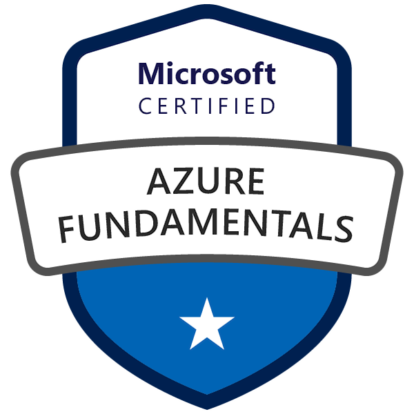
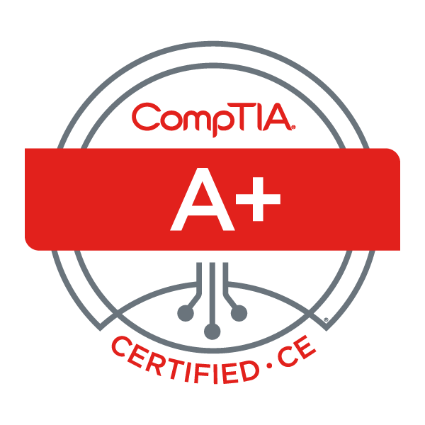
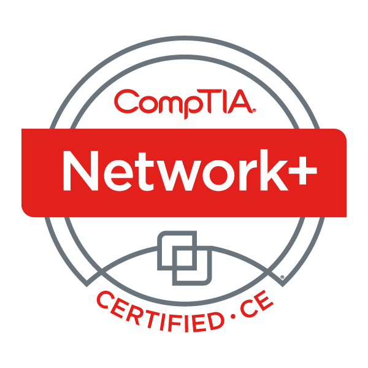

 Certifications like the one below help me stay current with the latest technologies and trends in the industry. The majority of these certifications require ongoing training and education to maintain, which helps me stay up-to-date with the latest developments in the field.

<h2 style="text-align:center;">Microsoft Certified: Azure Administrator Assoicate</h2>

<h2 style="text-align:center;">Microsoft Certified: Azure Fundamentals</h2>

<h2 style="text-align:center;">CompTIA A+ ce</h2>

<h2 style="text-align:center;">CompTIA Network+ ce</h2>

