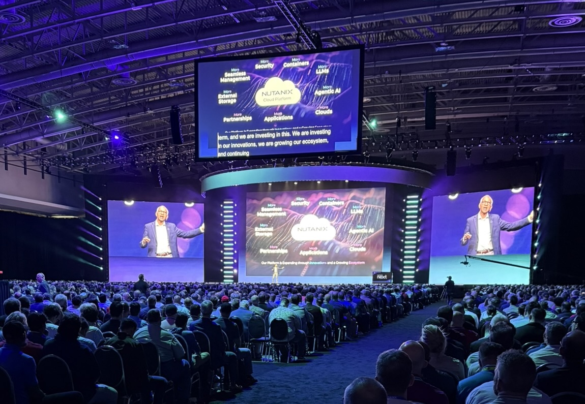

Just got back from the Nutanix .NEXT conference in D.C., and figured I’d throw together a quick recap while it’s still fresh. Overall—really solid experience.

One of the highlights for me was hearing Glenn Allison from Tractor Supply Company speak. He walked through how they’re supporting hundreds of store locations with Nutanix, and what really stood out was how practical and down-to-earth his talk was. It wasn’t a sales pitch—just straight-up insight on what works and what doesn’t at scale.

I also sat in on a Disaster Recovery session that helped clarify how Metro-Availability fits into the bigger picture. I’ve seen it mentioned plenty before, but this was the first time it really clicked. They covered not just the tech itself but how people are actually using it in real environments.

Another session I got a lot out of was from Reed Beaver at Dawn Foods, who talked about their move from VMware’s ESXi to AHV. With everything going on in the virtualization world, this one felt super relevant. He was honest about the challenges, but also really clear about why they made the switch and how it’s been going since.

One of the more unique parts of the week was getting to take part in the nuExperience session. I can’t really share the details of what was discussed, but what I will say is it felt good to be included. Even though I’m relatively new to Nutanix and managing a smaller environment, it never felt like my perspective didn’t matter. They really seemed to want input from users at all levels.

And, as a bonus—D.C. had some great food. No complaints there.

All in all, .NEXT was definitely worth the trip. Left with a few ideas I’m looking forward to trying out, and a better handle on where things are headed with the platform.



Until next time, 

Be well!
