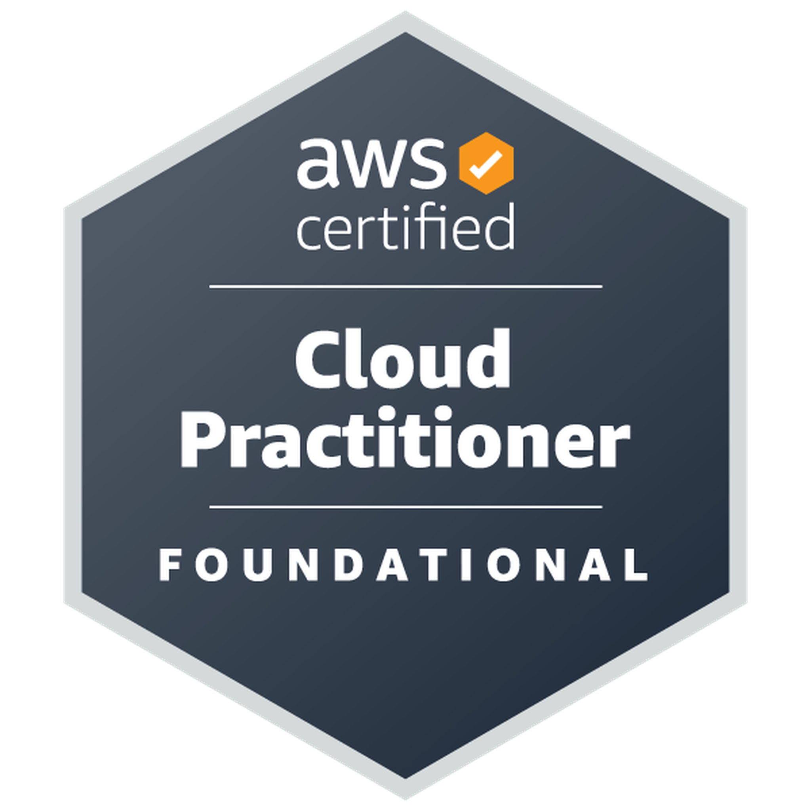

Certifications like the ones below have helped me learn new skills and also validate the ones that I have. The majority of these certifications require ongoing training and education to maintain. This helps me stay up-to-date with the latest developments in the field. As of May 10th, 2023, I’m an AWS Certified Cloud Practitioner. I’m continuing my studies by preparing to take some traning specific to Nutanix!
|   |
|:-:|

|   |   |
|:-:|:-:|
|  |  |

|   |   |
|:-:|:-:|
|  | |

