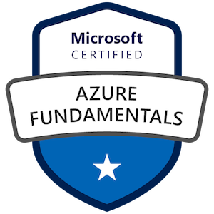
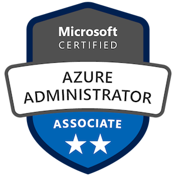
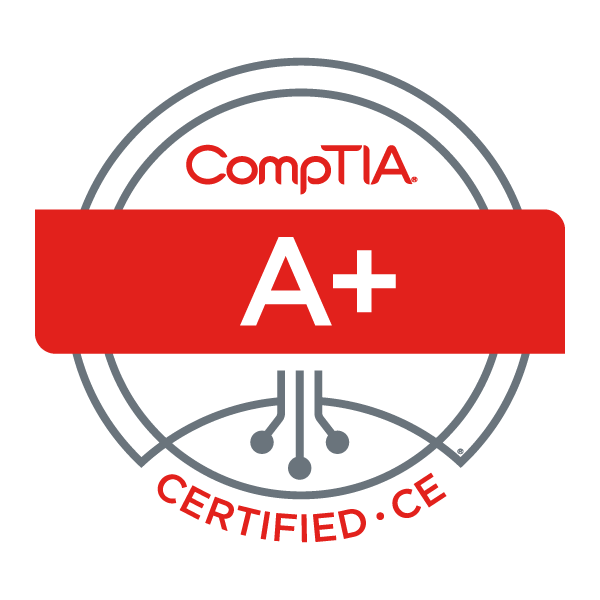
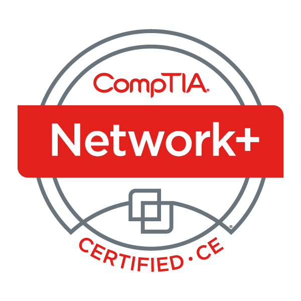

Certifications like the ones below have helped me learn new skills and also validate the ones that I have. The majority of these certifications require ongoing training and education to maintain. This helps me stay up-to-date with the latest developments in the field. I'm currently studying to take Amazon's CLF-C01 exam. I'll be an AWS Certified Cloud Practitioner when I complete this certification. More about this certification can be found on AWS' site [here](https://aws.amazon.com/certification/certified-cloud-practitioner/).

|   |   |
|:-:|:-:|
|  |  |
|  | |

